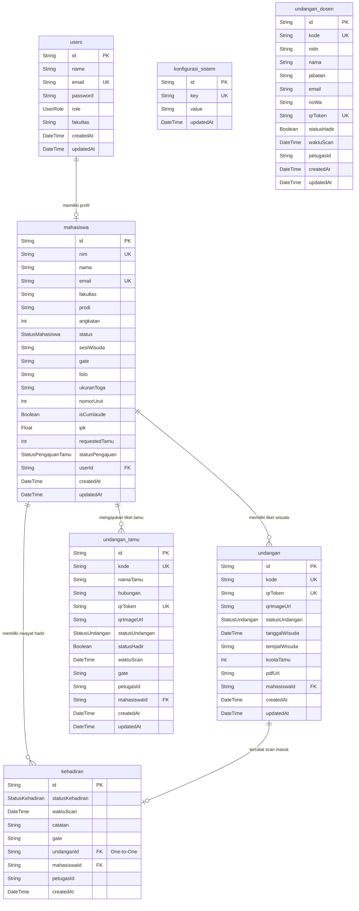
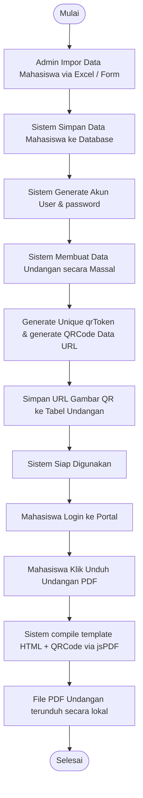
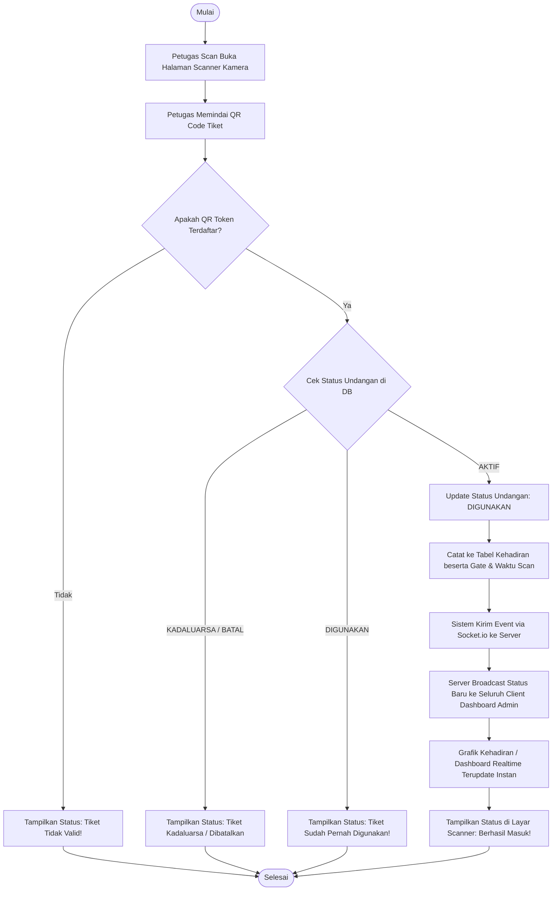
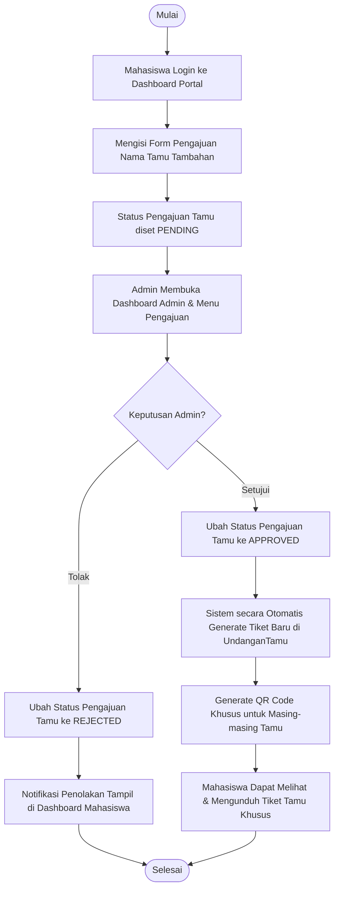

# Dokumen Analisis Sistem Informasi Wisuda Digital (Skripsi)

Dokumen ini disusun sebagai bahan komprehensif pendukung penyusunan Bab 3 (Metodologi/Perancangan) dan Bab 4 (Implementasi/Pembahasan) Tugas Akhir/Skripsi.

---

## 1. Spesifikasi Teknologi & Stack (Tech Stack & Architecture)

Sistem ini dirancang menggunakan pendekatan modern berbasis *monorep-like structure* di dalam Next.js App Router.

| Komponen Stack | Teknologi / Pustaka | Peran & Deskripsi |
| :--- | :--- | :--- |
| **Framework Utama** | Next.js 16.2.6 (React 19) | Menyediakan routing cepat (*App Router*), *Server-Side Rendering* (SSR), serta API Route Handlers. |
| **Bahasa Pemrograman**| TypeScript | Menjamin keamanan tipe (*type safety*) dan efisiensi penulisan kode terstruktur. |
| **Database Engine** | PostgreSQL | Penyimpanan data relasional transaksional (mahasiswa, scan, kehadiran). |
| **ORM / Data Access** | Prisma ORM 7.8.0 | Mengabstraksikan query SQL ke bentuk Javascript/TypeScript API dengan automasi migrasi schema. |
| **Styling & UI Kit** | TailwindCSS v4 + Radix UI | Desain visual adaptif, modern, ultra-cepat, dan memiliki performa rendering tinggi. |
| **State Management** | Zustand 5.0.13 | Mengelola *global state* di sisi client secara ringan tanpa *boilerplate* berlebihan. |
| **Realtime Sync** | Socket.io 4.8.3 | Sinkronisasi status kehadiran instan saat pemindaian QR Code antara petugas scan dan dashboard. |
| **QR Code Scanner** | html5-qrcode 2.3.8 | Akses kamera client untuk memindai QR Code tiket wisudawan secara realtime. |
| **Generator QR Code** | qrcode 1.5.4 | Membuat data URL gambar QR Code berdasarkan token acak unik untuk tiket wisuda. |
| **Document Generator**| jspdf 4.2.1 + html2canvas | Pembuatan tiket cetak e-Undangan PDF langsung di sisi peramban (*client-side*). |
| **Data Importer** | xlsx 0.18.5 | Parser spreadsheet untuk fitur impor data massal (*bulk import*) mahasiswa berformat Excel. |
| **Autentikasi** | JSON Web Tokens (JWT) + bcryptjs | Mekanisme pengamanan sesi API dan enkripsi *password* pengguna menggunakan algoritma Blowfish. |

---

## 2. Struktur Folder & Perancangan File (AppDev Structure)

| Direktori Utama | Sub-Direktori/File | Penjelasan Arsitektur |
| :--- | :--- | :--- |
| `src/app/` | `api/` | Berisi route handlers untuk melayani request RESTful API. |
| | `(admin)/` | Layout, dashboard, kelola mahasiswa, kehadiran, laporan, pengaturan, & monitoring kursi untuk admin. |
| | `(mahasiswa)/` | Halaman dashboard mahasiswa untuk memantau status kelulusan & tiket undangan. |
| | `(petugas)/` | Antarmuka khusus petugas untuk mengakses modul pemindai QR Code. |
| | `login/` | Halaman gerbang masuk (autentikasi) tunggal multi-peran. |
| `src/features/` | `auth/`, `mahasiswa/`, etc. | Komponen internal, hooks, dan fungsi logic terisolasi per domain bisnis. |
| `src/components/` | `ui/` | Komponen visual dasar reusable (Buttons, Modals, Cards, Dialogs). |
| | `layout/` | Navigasi utama, Sidebar dinamis, dan Header pembatas otorisasi peran. |
| `src/store/` | Zustand Stores | Penjaga konsistensi data client (misal: data session, state scanner). |
| `src/lib/` | `prisma.ts`, `socket.ts` | Konfigurasi instance koneksi eksternal yang diinisialisasi sekali (*singleton*). |

---

## 3. Entity Relationship Diagram (ERD)

Berikut adalah visualisasi database relasional yang dirancang menggunakan Prisma ORM dan PostgreSQL:

---

## 4. Alur Kerja Sistem (System Flowcharts)

### A. Alur Pembuatan Undangan & Tiket QR (Undangan Generation Flow)
Menjelaskan bagaimana sistem memproses registrasi mahasiswa hingga menerbitkan tiket e-undangan dalam bentuk PDF ber-QR Code.

---

### B. Alur Validasi Tiket Kehadiran Realtime (QR Code Scanner & Realtime Flow)
Alur ketika Wisudawan/Tamu datang ke lokasi dan melakukan scan tiket QR di gerbang masuk (*Gate*).

---

### C. Alur Pengajuan Kursi/Tiket Tamu Tambahan (Guest Request Flow)
Alur pengajuan kuota tamu tambahan oleh mahasiswa dan proses persetujuan oleh Admin.

---

## 5. Implementasi Hak Akses Fitur (Role-Based Access Matrix)

Tabel berikut memetakan otorisasi hak akses (*Access Control Matrix*) fitur-fitur di dalam aplikasi:

| Fitur / Modul | Super Admin | Admin Fakultas | Petugas Scan | Mahasiswa |
| :--- | :---: | :---: | :---: | :---: |
| **Konfigurasi Global Sistem** | ✔ (Bisa ubah) | ❌ | ❌ | ❌ |
| **Impor & Hapus Mahasiswa** | ✔ | ✔ (Fakultas sendiri) | ❌ | ❌ |
| **Generate Masal Undangan** | ✔ | ✔ | ❌ | ❌ |
| **Persetujuan Kuota Tamu** | ✔ | ✔ (Fakultas sendiri) | ❌ | ❌ |
| **Akses Modul Kamera QR Scanner**| ✔ | ❌ | ✔ | ❌ |
| **Melihat Dashboard Realtime**| ✔ | ✔ (Fakultas sendiri) | ❌ | ❌ |
| **Download PDF Undangan Sendiri**| ❌ | ❌ | ❌ | ✔ |
| **Ajukan Tiket Tamu Tambahan** | ❌ | ❌ | ❌ | ✔ |
| **Unduh Laporan Kehadiran (Excel)**| ✔ | ✔ (Fakultas sendiri) | ❌ | ❌ |
